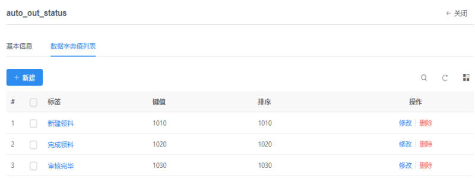
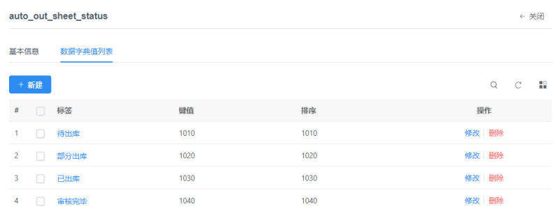
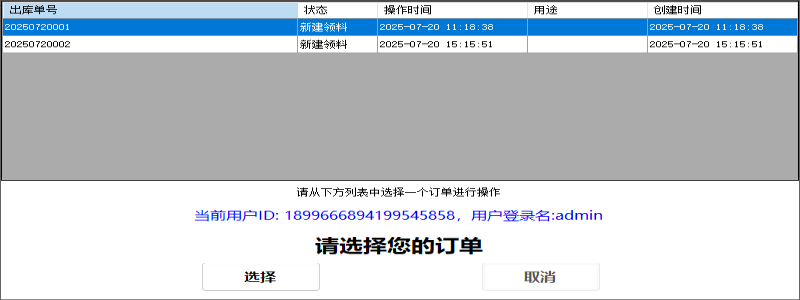
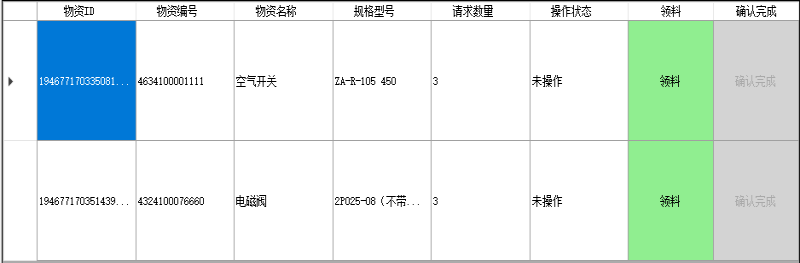
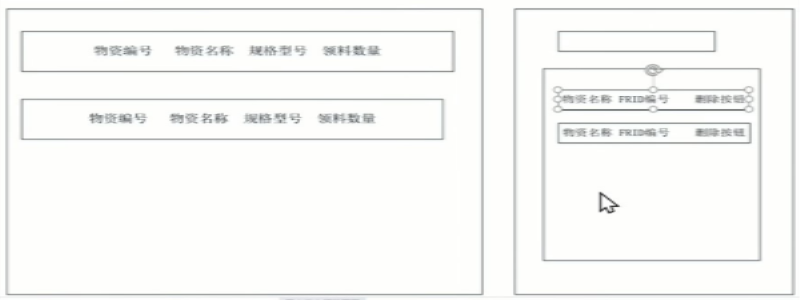
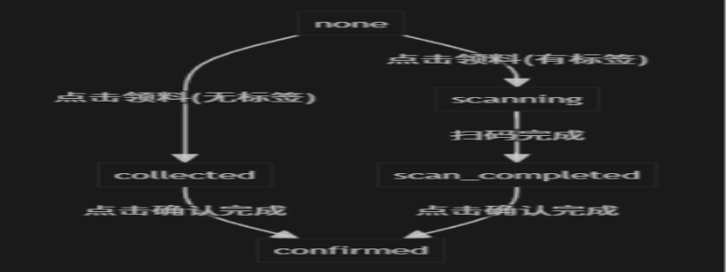

# 陡河水电站无人值守文档

## 1.涉及的表

陡河水电站无人值守项目，涉及到几个表：
- wms_auto_out_sheet出库单
- wms_auto_out_sheet_details出库单详情
- wms_auto_user_checkinrecord人员认证
- wms_rfid_material_relation 物资RFID记录表


wms_auto_out_sheet出库单ddl

``` sql
CREATE TABLE `wms_auto_out_sheet` (
  `id` varchar(64) NOT NULL DEFAULT '0' COMMENT '主键',
  `out_sheet_code` varchar(32) DEFAULT NULL COMMENT '出库单号',
  `out_sheet_status` varchar(32) DEFAULT NULL COMMENT '出库单状态（默认写入：1010）',
  `operator_id` varchar(32) DEFAULT NULL COMMENT '领料人ID',
  `office_id` varchar(32) DEFAULT NULL COMMENT '领料部门ID',
  `operator_time` datetime DEFAULT NULL COMMENT '领料时间',
  `purpose` varchar(100) DEFAULT NULL COMMENT '用途',
  `create_by_id` varchar(64) DEFAULT NULL COMMENT '创建者',
  `create_time` datetime DEFAULT NULL COMMENT '创建时间',
  `update_by_id` varchar(64) DEFAULT NULL COMMENT '更新者',
  `update_time` datetime DEFAULT NULL COMMENT '更新时间',
  `del_flag` int(11) DEFAULT NULL COMMENT '逻辑删除标记（0：显示；1：隐藏)',
  `version` int(11) DEFAULT NULL COMMENT '版本号',
  `auditor_id` varchar(64) DEFAULT NULL COMMENT '审核人ID',
  `audit_time` datetime DEFAULT NULL COMMENT '审核时间',
  `is_mobile_out` tinyint(255) DEFAULT NULL COMMENT '移动端出库状态 0未出库，1出库',
  PRIMARY KEY (`id`)
) ENGINE=InnoDB DEFAULT CHARSET=utf8 COMMENT='无人值守出库单';
```
wms_auto_out_sheet_details出库单详情ddl

``` sql
CREATE TABLE `wms_auto_out_sheet_details` (
  `id` varchar(64) NOT NULL COMMENT '主键',
  `logic_location_code` varchar(32) DEFAULT NULL COMMENT '货位编号',
  `out_sheet_id` varchar(32) DEFAULT NULL COMMENT '出库单ID',
  `out_sheet_code` varchar(32) DEFAULT NULL COMMENT '出库单编号',
  `auto_out_sheet_status` varchar(32) DEFAULT NULL COMMENT '出库状态',
  `material_code` varchar(32) DEFAULT NULL COMMENT '物资编码',
  `material_name` varchar(100) DEFAULT NULL COMMENT '物资名称',
  `request_quantity` double DEFAULT NULL COMMENT '申请数量',
  `out_quantity` double DEFAULT NULL COMMENT '领料数量',
  `specification` varchar(100) DEFAULT NULL COMMENT '规格型号',
  `category` varchar(32) DEFAULT NULL COMMENT '分类',
  `unit_name` varchar(32) DEFAULT NULL COMMENT '单位名称',
  `create_by_id` varchar(32) DEFAULT NULL COMMENT '创建者',
  `create_time` datetime DEFAULT NULL COMMENT '创建时间',
  `update_by_id` varchar(32) DEFAULT NULL COMMENT '更新者',
  `update_time` datetime DEFAULT NULL COMMENT '更新时间',
  `del_flag` int(11) DEFAULT NULL COMMENT '逻辑删除标记（0：显示；1：隐藏)',
  `operation_status` varchar(255) DEFAULT NULL COMMENT '李银锁添加，none：未操作，collected：已领料（无标签物料可直接确认），scanning：正在扫码（有标签物料），scan_completed：扫码完成，待确认（有标签物料），confirmed：已确认完成，无标签物料：collected → confirmed\r\n有标签物料：collected → scanning → scan_completed → confirmed',
  PRIMARY KEY (`id`)
) ENGINE=InnoDB DEFAULT CHARSET=utf8 COMMENT='无人值守出库单详情';

```


wms_auto_user_checkinrecord人员认证ddl

``` sql
CREATE TABLE `wms_auto_user_checkinrecord` (
  `id` varchar(64) CHARACTER SET utf8 COLLATE utf8_bin NOT NULL COMMENT '表ID标识',
  `userid` varchar(64) CHARACTER SET utf8 DEFAULT NULL COMMENT '用户表ID',
  `userloginname` varchar(100) CHARACTER SET utf8 DEFAULT NULL COMMENT '用户登录名',
  `username` varchar(100) CHARACTER SET utf8 DEFAULT NULL COMMENT '用户姓名',
  `checkinstate` int(11) DEFAULT NULL COMMENT '状态：1标识当前在自动取货间内，0标识已离开',
  `checkintime` datetime DEFAULT NULL COMMENT '用户进入自动取货间时间',
  `checkouttime` datetime DEFAULT NULL COMMENT '用户退出自动取货间时间',
  `last_active_time` datetime DEFAULT NULL COMMENT '用户上次操作时间，激活时间，用于心跳检测',
  `remark` varchar(255) DEFAULT NULL COMMENT '备注',
  PRIMARY KEY (`id`)
) ENGINE=InnoDB DEFAULT CHARSET=utf8mb4;

```

wms_rfid_material_relation 物资RFID记录表
``` sql
CREATE TABLE `wms_rfid_material_relation` (
  `id` varchar(32) NOT NULL COMMENT '主键',
  `rfid_code` varchar(32) DEFAULT NULL COMMENT 'rfid码',
  `container_code` varchar(64) DEFAULT NULL COMMENT '箱号/托盘号',
  `material_id` varchar(32) DEFAULT NULL COMMENT '物资ID',
  `material_code` varchar(32) DEFAULT NULL COMMENT '物资编码',
  `material_name` varchar(100) DEFAULT NULL COMMENT '物资名称',
  `material_quantity` double DEFAULT '1' COMMENT '物资数量',
  `rfid_instore_flag` varchar(32) DEFAULT NULL COMMENT '在库标记',
  `in_sheet_id` varchar(32) DEFAULT NULL COMMENT '入库单ID',
  `in_sheet_code` varchar(32) DEFAULT NULL COMMENT '入库单号（移库保留）',
  `in_sheet_detail_id` varchar(32) DEFAULT NULL COMMENT '入库单子表ID',
  `logic_location_id` varchar(32) DEFAULT NULL COMMENT '逻辑货位ID',
  `logic_location_code` varchar(64) DEFAULT NULL COMMENT '逻辑货位编号',
  `out_sheet_id` varchar(32) DEFAULT NULL COMMENT '出库单ID',
  `out_sheet_code` varchar(32) DEFAULT NULL COMMENT '出库单号',
  `out_sheet_detail_id` varchar(32) DEFAULT NULL COMMENT '出库单子表ID',
  `create_by_id` varchar(32) DEFAULT NULL COMMENT '创建者（打签人）',
  `create_time` datetime DEFAULT NULL COMMENT '创建时间',
  `update_by_id` varchar(32) DEFAULT NULL COMMENT '更新者',
  `update_time` datetime DEFAULT NULL COMMENT '更新时间',
  `version` int(11) DEFAULT NULL COMMENT '版本号',
  `del_flag` int(11) DEFAULT NULL COMMENT '逻辑删除标记（0：显示；1：隐藏)',
  `inputer_id` varchar(32) DEFAULT NULL COMMENT '入库人ID',
  `in_time` datetime DEFAULT NULL COMMENT '入库时间',
  `outputer_id` varchar(32) DEFAULT NULL COMMENT '出库人ID',
  `out_time` datetime DEFAULT NULL COMMENT '出库时间',
  `out_sheet_details_id` varchar(32) DEFAULT '',
  `physical_location_id` varchar(32) DEFAULT NULL,
  PRIMARY KEY (`id`)
) ENGINE=InnoDB DEFAULT CHARSET=utf8 COMMENT='物资RFID记录表';

```
下面是针对wms_auto_out_sheet（无人值守出库单状态）的状态字典




下面是针对wms_auto_out_sheet_detailsdd（无人值守出库单详情状态）的状态字典




## 2.大体流程

### 2.1 检测有效用户
软件启动的时候，首先会检测是否有符合要求的用户，涉及到表wms_auto_user_checkinrecord，

业务逻辑就是
``` sql

    select * from wms_auto_user_checkinrecord where checkinstate=1 order by checkintime DESC
w
```


原则上，我们这个表中，只会有一条符合要求的数据，即使有多条，根据排序顺序，最终会取最后一条有效数据。


### 2.2 获取用户订单
当我们获取到了有效用户以后，会尝试获取该用户的有效订单，如果获取到订单数量大于1，那么，显示订单选择界面

如果订单只有一条，那么，直接显示订单详情


涉及到表wms_auto_out_sheet


我们这里要过滤出***1010***的，是***当前用户的***出库单





首先，我们会获取用户订单的主表数据，然后让用户选择，因为可能有多条主表数据，每条主表数据会有多条详情信息。
当用户选择了一条数据后，界面上会绑定该条主表的详细信息。


### 2.3 领料

领料界面如下所示




#### 2.3.1 “领料”操作
领料业务操作内容如下：
- 向后台黄老师服务发送数据，物料ID等信息，通过post方式向后台一个服务接口发送数据
- 发送物资ID到后台，查询是否是打签的物资,如果有打签的数据，那么，右侧出现用户打签UI
- 发送物资ID到后台，查询是否是打签的物资,如果没有打签的数据，那么显示***确认完成*** 等待用户进一步操作


##### 2.3.1.1 用户扫签操作
右侧出现界面类似如下所示：



在这个界面上，用户需要用扫码枪扫描标签，这个标签对应的是wms_rfid_material_relation.rfid_code

用户需要根据这个数据，j检索数据

对应的获取数据sql如下
``` sql

    select * from wms_rfid_material_relation where rfid_instore_flag='1020'
       and material_code='左边用户点击的领料数据的物料code'

```

如果有数据，那么，应该绑定到下面，如果没有数据，那么，提示用户一下数据无效。

最终的列表的总量要和左边的  ***领料数量***   一致，才算完毕，用户才能进行下一步  ***确认完成***   操作


#### 2.3.2 确认完成操作
确认完成操作分为两种情况
1. 领料的数据没有打签
2. 领料的数据打签了


##### 2.3.2.1 没有打签-> “确认完成”操作
当领料操作执行后，修改了详情表wms_auto_out_sheet_details状态，接下来，就需要把操作按钮变更为“确认完成”

确认完成，这个按钮的事件主要为以下几点：
- 修改wms_auto_out_sheet_details的出库状态auto_out_sheet_status和out_quantity领取字段

``` sql
    update wms_auto_out_sheet_details set auto_out_sheet_status='1030' and out_quantity=123  where id='1946375848610562049'
```

- 如果这条详情数据是主单的唯一数据，那么，需要相应修改wms_auto_out_sheet表，out_sheet_status状态为***1020***

``` sql
    update  wms_auto_out_sheet set out_sheet_status='1020 ' where id='xxx'
```

- 向AGV小车发送指令


##### 2.3.2。2 打签-> “确认完成”操作
当这条数据是有打签的话，那么，***确认完成*** 操作需要在上面2.3.2.1操作基础上，额外进行对wms_rfid_material_relation表

进行相应更新操作，这操作应该是事务操作，涉及到多条数据

``` sql

  update wms_rfid_material_relation 
    set rfid_instore_flag='1030'，
    out_sheet_id='出库单ID',
    out_sheet_code='出库单号',
    out_sheet_detail_id='出库子单ID'，
    outputer_id='出库人ID'，
    out_time=#出库时间#

  where rfid_code='右侧列表中的rfid码'

``` 


#### 2.3.1.2 详情表operation_status业务流转说明

为支持界面刷新和业务流转控制，wms_auto_out_sheet_details表新增了`operation_status`字段，记录每条详情的业务操作状态。

**字段定义：**

- `operation_status` varchar(255) DEFAULT NULL COMMENT 'none：未操作，collected：已领料（无标签物料可直接确认），scanning：正在扫码（有标签物料），scan_completed：扫码完成，待确认（有标签物料），confirmed：已确认完成，无标签物料：collected → confirmed，有标签物料：collected → scanning → scan_completed → confirmed'


**无标签物料业务流：**
- none → collected → confirmed
- 点击“领料”后直接进入collected，允许“确认完成”

**有标签物料业务流：**
- none → scanning → scan_completed → confirmed
- 点击“领料”后进入scanning，弹出RFID扫码UI
- 扫码数量达到要求后，进入scan_completed，允许“确认完成”

**按钮可用性控制：**
- 只有operation_status为none时，“领料”按钮可用
- 只有operation_status为collected（无标签）或scan_completed（有标签）时，“确认完成”按钮可用
- 其他状态下按钮均不可用

**状态更新时机：**
- 领料后：有标签物料更新为scanning，无标签物料更新为collected
- 扫码完成后：有标签物料更新为scan_completed
- 确认完成后：所有物料更新为confirmed 
- “扫码中”状态下，用户只能在右侧扫码UI操作，主表按钮不可点击。
- “已操作”状态下，按钮不可点击，点击无任何反应。
- 只有“领料”、“确认完成”按钮可点击，且分别进入领料和确认完成业务流程。

**业务流转与按钮行为：**
- “领料”按钮：仅在none状态下可用，点击后进入collected（无标签）或scanning（有标签）状态。
- “扫码中”按钮：仅在scanning状态下显示，主表按钮不可用，用户需在右侧扫码UI完成扫码。
- “确认完成”按钮：仅在collected或scan_completed状态下可用，点击后进入confirmed状态。
- “已操作”按钮：仅在confirmed状态下显示，按钮不可点击。

**代码实现要点：**
- DataGridView每行按钮文字和可用性由operation_status字段自动控制。
- 只有“领料”、“确认完成”按钮可点击，其它状态点击无任何反应。
- “确认完成”操作涉及多表更新，所有数据库操作均在同一事务中，确保原子性。
- “扫码中”状态下，只有右侧RFID扫码UI可用，主表按钮不可用。

Ran tool
已将“领料按钮”和“确认完成按钮”的可用性分别整理为两个独立表格，并直接追加到无人值守文档.md，内容如下：


#### 领料按钮可用性状态表

| operation_status | 领料按钮显示 | 领料按钮是否可点击 | 说明 |
|------------------|--------------|-------------------|------|
| none             | 绿色         | 可点击            | 允许点击“领料”按钮，进入领料流程 |
| collected        | 灰色         | 不可点击          | 已领料，需进行确认完成操作 |
| scan_completed   | 灰色         | 不可点击          | 已扫码完成，需进行确认完成操作 |
| scanning         | 灰色         | 不可点击          | 正在扫码，仅允许右侧扫码UI操作 |
| confirmed        | 灰色         | 不可点击          | 操作已完成，按钮禁用 |

#### 确认完成按钮可用性状态表

| operation_status | 确认完成按钮显示 | 确认完成按钮是否可点击 | 说明 |
|------------------|------------------|----------------------|------|
| none             | 灰色             | 不可点击             | 需先领料，按钮禁用 |
| collected        | 绿色             | 可点击                | 允许点击，进入确认完成流程（无标签物料） |
| scan_completed   | 绿色             | 可点击                | 允许点击，进入确认完成流程（有标签物料扫码完成） |
| scanning         | 灰色             | 不可点击             | 正在扫码，仅允许右侧扫码UI操作 |
| confirmed        | 灰色             | 不可点击             | 操作已完成，按钮禁用 |


操作按钮-业务流程图




